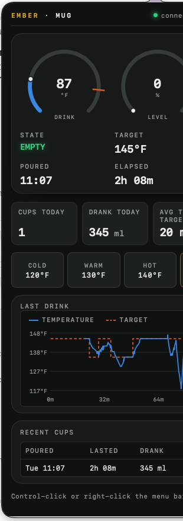
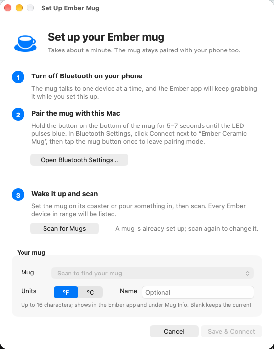

# Ember Mug Menu Bar App 🫖

A small macOS menu bar app that shows what your Ember mug is doing and lets you control it — no phone required.


<p align="center">
  
  &nbsp;&nbsp;
  
</p>

Click the cup for the instrument panel; right-click for the menu:

```
☕ 137°F ▲
├── Status: Connected · Ember Mug 2 (14oz)
├── Today: 2 cups · 12 oz · poured 11:07
├── Battery: 78% ⚡ charging
├── Liquid: Heating · 80% full
├── Current: 137.2°F
├── Target: 140°F
├── Ready in: ~3 min
├── LED: #ff6400
├──────────
├── Set Temperature ▸   Cold / Warm / Hot / Very Hot / Custom… / Heating Off
├── LED Colour ▸        White / Red / Orange / Yellow / Green / Cyan / Blue / Purple / Pink
├── Schedule ▸          Morning 05:00–11:00 → 140°F … / Apply automatically on refill / Apply now / Edit…
├── Mug Info ▸          Name / Model / Serial / Firmware / Address / Mug display unit / Rename Mug…
├── Drink Log…
├──────────
├── Units ▸             °F / °C
├── Notifications ▸     When drink reaches target / Low battery
├── Start at Login
├── Set Up Mug…
├──────────
├── Reconnect
├── Open Log
└── Quit
```

It also decodes the mug's undocumented on-device drink log (the `fc540013` statistics stream), so every cup is recorded even when the Mac wasn't listening. As far as I know this is the first public write-up of that format: `docs/statistics-stream.md`.

## What it does

- **Live status in the menu bar** — temperature with a heating ▲ / cooling ▼ / ready ✓ hint, or `Empty` when there's nothing in it.
- **Push updates, not polling** — built on [python-ember-mug](https://github.com/sopelj/python-ember-mug), so the mug tells the app when something changes. A full refresh runs once a minute as a safety net.
- **Reconnects on its own** — when the mug goes to sleep (empty, off the coaster) the app backs off and re-scans until it's back. No need to relaunch.
- **Liquid state and level**, battery + charging, target and current temperature, LED colour.
- **Temperature presets** (configurable), custom temperature, and "Heating Off".
- **LED colour** that survives the phone app fighting you: the colour you pick here is saved and re-applied if something else changes it.
- **Notifications** when your drink reaches the target temperature and when the battery is low.
- **Start at Login** toggle in the menu — no digging through System Settings.
- **°F / °C** toggle, optionally pushed to the mug so the Ember phone app shows the same unit.
- **Setup window** on first launch (and under *Set Up Mug…*): pairing instructions, a live scan that lists every Ember device in range with signal strength, unit choice, and an optional rename.
- **Ready in ~N min** estimate while heating, from the last few minutes of readings; a **Temperature History** graph window; readings logged to `~/Library/Application Support/EmberMug/history.jsonl`.
- **Time-of-day schedule**: e.g. 140°F mornings, 130°F evenings, applied automatically when you refill (opt-in).
- **Click the icon for an instrument panel** (popover): gauges, today's numbers, presets, the current drink's trace. Right-click for the menu.
- **CLI / Raycast**: `--status` prints JSON (or `--brief` one-liner) from the running app; `--set-temp`, `--led`, `--heating-off` send commands to it. A ready-made Raycast script command lives in `raycast/`.

## Requirements

- macOS 12 or newer, Apple Silicon or Intel (developed and tested on macOS 26 / Apple Silicon; reports from other versions welcome)
- Python 3.11+ (3.14 tested)
- An Ember Mug / Mug 2 / Cup / Tumbler / Travel Mug that has been set up once in the Ember phone app

## Install

```bash
git clone https://github.com/gwhillhouse/ember-mug-app.git
cd ember-mug-app

# 1. Dependencies (uv: https://docs.astral.sh/uv/)
uv venv && uv pip install -r requirements.txt

# 2. Build the app bundle and launch it
./build_app.sh --launch
```

A cup icon appears in your menu bar and, on first launch, a **Set Up Ember Mug** window walks you through the rest: turn off Bluetooth on your phone (the mug only talks to one device at a time), pair the mug with the Mac from Bluetooth Settings (hold the button on the bottom 5–7 s until the LED pulses blue, then tap it once), click **Scan**, pick your mug, choose °F or °C, optionally name it, and **Save & Connect**. You can rerun it any time from *Set Up Mug…*.

Turn on **Start at Login** from the menu if you want it always there. macOS asks once for Bluetooth access on behalf of Python.

To run without the bundle (handy while hacking on it):

```bash
uv run ember_mug_app.py
```

## Configuration

`config.json` is created on first run and lives next to the script (it's git-ignored). See `config.example.json`:

| Key | Default | Meaning |
|---|---|---|
| `mug_address` | `""` | Bluetooth address (a UUID on macOS). Blank = find by name and save it. |
| `temperature_unit` | `"F"` | `"F"` or `"C"`; also switchable from the menu. |
| `menu_icon` | `""` | Blank = system cup icon (SF Symbol). Set text/emoji (e.g. `"🫖"`) to use that instead. |
| `presets_f` | Cold 120 … Very Hot 145 | Label → °F for the Set Temperature menu (120–145 °F is the mug's range). |
| `full_refresh_seconds` | `60` | How often to re-read everything, in addition to push events. |
| `scan_timeout_seconds` | `15` | How long each scan waits before backing off. |
| `notify_on_perfect` | `true` | Notification when the drink hits the target. |
| `notify_low_battery` | `true` | Notification when battery ≤ `low_battery_percent` and not charging. |
| `led_colour` | `null` | Saved LED colour `[r, g, b]`; set from the menu. |
| `sync_unit_to_mug` | `true` | Also set the mug's own display unit (what the Ember phone app shows) to match. |
| `auto_schedule` | `false` | Apply the matching `schedule` rule each time the mug goes from empty to filled. Never changes a drink already in progress. |
| `schedule` | Morning/Afternoon/Evening | List of `{label, start, end, temp_f}`; `end` may wrap past midnight. Shown under *Schedule*. |
| `history_hours` | `12` | How much history the graph keeps in memory. |

## Sharing the mug with your phone

An Ember mug accepts **one** Bluetooth connection at a time, and the Ember phone app reconnects aggressively whenever it can see the mug. So the Mac and the phone can't both be connected; they take turns:

- **Hand Off to Phone (30 min)** in the menu (or `--handoff [minutes]`) drops the Mac's connection and stops reconnecting, so the phone app can grab the mug. The menu bar shows `on phone`; the app reconnects by itself when the time is up, or immediately via **Take Mug Back Now** / `--takeback`.
- Going the other way, the phone has to let go first: on the iPhone, Settings → Bluetooth → ⓘ next to the mug → **Disconnect** (or turn Bluetooth off, or walk out of range). The Mac notices within ~20 s and reconnects. While the phone holds the mug, the status line says *connected to another device* rather than *not reachable*.
- If the mug lives on your desk, the natural rhythm is: Mac holds it at the desk; when you walk away with it, the phone picks it up; when you come back, it stays with the phone until the phone drops it.

## Drink log

The mug keeps its own log of every drink (pour, target changes, set-downs, a level/temperature sample every 10 minutes, a battery snapshot) and hands it to the first Bluetooth client that asks; this app is that client, so drinks poured while the Mac was away still get recorded when you sit back down. `drinklog.py` decodes it (format in `docs/statistics-stream.md`), merges in the app's own second-by-second readings while connected, and keeps:

- `~/Library/Application Support/EmberMug/drinks.jsonl` — one row per drink (pour time, target, time to target, set-downs, level start→end, ml consumed, abandoned or not);
- `daily.json` — today's summary (cups, ml, first/last pour, averages), for briefings and scripts;
- `status.json` gains a `today` block.

**Left-click the menu bar icon** for the instrument panel: live gauges (drink temperature with the target tick, level, battery), state and ETA, today's totals, one-tap presets, the current drink's temperature trace, and recent cups. **Right-click** (or ctrl-click) for the settings menu, which also shows *Today: 2 cups · 12 oz · poured 11:07*; **Drink Log…** there opens the full page (`drink-log.html`) with every drink and the raw record tape. `python drinklog.py --html out.html` builds the same page; `--from-capture` rebuilds every drink from the raw packet capture for validation.

## Scripts, Raycast, and other agents

While the app is running it keeps `~/Library/Application Support/EmberMug/status.json` current, and watches `command.json` in the same folder. The script exposes both:

```bash
python ember_mug_app.py --status            # JSON: temps, battery, liquid state, ETA, serial, firmware…
python ember_mug_app.py --status --brief    # "137°F → 140°F · Heating, ready in ~3 min · battery 78%"
python ember_mug_app.py --set-temp 140      # in the app's unit; or 60C / 140F
python ember_mug_app.py --heating-off
python ember_mug_app.py --led blue          # names from the LED menu, or #rrggbb; "off" = white
python ember_mug_app.py --setup             # open the setup window
python ember_mug_app.py --panel             # open the instrument panel (same as clicking the icon)
python ember_mug_app.py --handoff 20        # release the mug to your phone for 20 min
python ember_mug_app.py --takeback          # reconnect now
```

Exit code is 0 when connected, 1 when the app is up but the mug isn't, 2 when the app isn't running. `raycast/ember-mug.sh` is a Raycast Script Command that shows the brief status inline and takes an optional temperature argument; add the `raycast` folder as a Script Directory in Raycast.

## Troubleshooting

**Menu shows "Mug not reachable — retrying"**
The mug is asleep, out of range, or connected to your phone. Lift it, set it on the coaster, or turn off Bluetooth on the phone. The app keeps retrying (5 s → 60 s backoff); **Reconnect** in the menu forces an immediate attempt.

**It never finds the mug**
Open *Set Up Mug…* and click **Scan**: it lists every Ember device in range with signal strength. If nothing shows, the mug isn't paired with this Mac or your phone still has it. `uv run find_mug.py` does the same from a terminal.

**Solid red LED on the mug**
Low battery. The mug refuses Bluetooth connections in this state; put it on the coaster and wait a few minutes. (Flashing yellow means you held the button into reset mode, 8–10 s; pairing is 5–7 s, blue.)

**Bluetooth permission**
macOS will ask once for Bluetooth access on behalf of Python. If you denied it: System Settings → Privacy & Security → Bluetooth.

**Logs**
`~/Library/Logs/EmberMug/ember-mug.log` (also **Open Log** in the menu). The launcher's own output is in `launcher.log` next to it.

## How it works

`ember_mug_app.py` runs a [rumps](https://github.com/jaredks/rumps) menu bar app on the main thread and a BLE `asyncio` loop on a background thread. python-ember-mug handles the Ember GATT protocol, subscribes to the mug's push-event characteristic, and fires a callback when anything changes; the app marshals those updates onto the main thread and redraws the menu. `build_app.sh` wraps the script in a minimal `.app` whose launcher starts Python detached; the app hides itself from the Dock by setting the accessory activation policy in code. (Don't `exec` Python from the launcher: on recent macOS the status item then never draws.)

## Tested with

Ember Mug 2 (14 oz), firmware 406, hardware 10. The GATT layout is the same across Ember's mugs, cups, tumblers and travel mugs per python-ember-mug, but the drink-log decoder has only been validated against this mug. If yours differs, `--stats` captures raw packets to `stats-capture.jsonl`; an issue with that file attached is the fastest way to get it supported.

## License and disclaimer

MIT — see `LICENSE`.

This is an independent project. It is not affiliated with, endorsed by, or supported by Ember Technologies, Inc. "Ember" is their trademark and is used here only to say which mugs the app works with. The app talks to the mug over the same Bluetooth interface any paired device uses; it does not modify the mug, its firmware, or its settings beyond the temperature, LED, name and unit controls the mug exposes.
